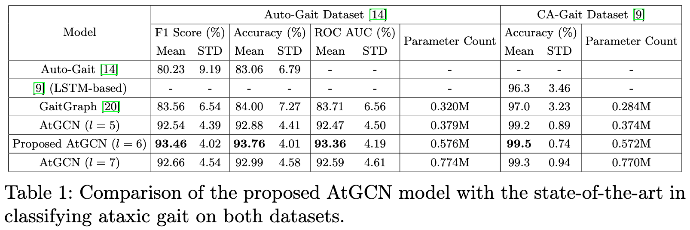

# AtGCN
A lightweight Spatiotemporal GCN for Ataxia Detection.


To make our pipeline fuly reproducible, we provide all the code used and also instructions on how to run it.

## Data Preparation - V1
Please download the first dataset we have used from [here](https://github.com/ROC-HCI/Automated-Ataxia-Gait); if you want to use your own dataset, the same instructions as below follow.

1. First create a folder named `data/` in the root directory of the project.
2. Use the `FRCNN_OpenPose_SORT.ipynb` from the `preprocess/` directory on Google Colab to get keypoints of the patient, store these inside the `data/` directory in a folder named `final_keypoints/`. (Note: this step takes **~4 hours** for the 149 videos we had with a T4 GPU)
3. Using these keypoints we can now extract *non-overlapping* gait cycles. To do this, run the `gait_extractor.py` script from the `preprocess/` directory. This will create a folder named `non_overlapping_gait_cycles/` inside the `data/` directory (or `gait_cycles/` if you want to extract overlapping gait cycles, we use non-overlapping gait-cycles in the paper and have not tested the overlapping case). Run with -
```bash
python preprocess/gait_extractor.py 1
```
4. Finally, we create CSV files from which we can quickly retrieve data and use it in our training loop, you can use `create_csvs.py` from the `preprocess/` directory to create these CSV files, in our format.

This will create the folder with all the files and extracted Gait Cycles (overlapping and non-overlapping, both).

## Data Preparation - V2
We have another dataset of 40 videos, which can be downloaded from [here](https://data.mendeley.com/datasets/2vkk2r9tx3/1) / [paper](https://hisham246.github.io/uploads/iecbes2022khalil.pdf). This already has extracted keypoints. **NOTE:** according to current preprocessing, you can only use one dataset at a time, as the CSV files are overwritten. To switch between datasets, just rename the folders accordingly.

1. Use the `process_v2.py` from the `preprocess/` directory, which will store the keypoints in .npy files, we also add a center coordinate to the keypoints.
2. Then use the `gait_extractor.py` to extract non-overlapping gait cycles (will be saved similarly to the first dataset). Run with 
```bash
python preprocess/gait_extractor.py 2
```
3. Finally, create the CSV files using `create_csvs.py` from the `preprocess/` directory.


## Model checkpoints
We have already uploaded the required checkpoints inside `ckpts/`. These were taken from -
- STGCN checkpoints : [here](https://github.com/yysijie/st-gcn/blob/master/OLD_README.md).
- GaitGraph checkpoints : [here](https://github.com/tteepe/GaitGraph).


## Training
First we need to install the dependencies (We have used python 3.9.19)
```bash
pip install -r requirements.txt
```
OR if you use conda, then first run
```bash
conda create -n ataxia-sync python=3.9.19
```
To train a model you can use the `runner.sh` with `sbatch` on an HPC or with `bash` on your local machine.
```bash
bash runner.sh
```
You can also check the flags using 
```python
python src/trainer.py --help # or -h
```
To reproduce our results, you can run the `runner.sh` as is. A full 10-fold CV run takes about **40 minutes** on a single V100 GPU.

## Analysis
You can also reproduce all the plots and tables in the paper using `src/analyze.py`, just uncomment all the lines after `if __name__ == "__main__"`, and run,
```bash
python3 src/analyze.py
```
### Main results


Please create an issue if you need some functionality or the code doesn't work as intended. Thank you!

## Citation
```bibtex
@misc{bania2024atgcngraphconvolutionalnetwork,
      title={AtGCN: A Graph Convolutional Network For Ataxic Gait Detection}, 
      author={Karan Bania and Tanmay Verlekar},
      year={2024},
      eprint={2410.22862},
      archivePrefix={arXiv},
      primaryClass={cs.CV},
      url={https://arxiv.org/abs/2410.22862}, 
}
```